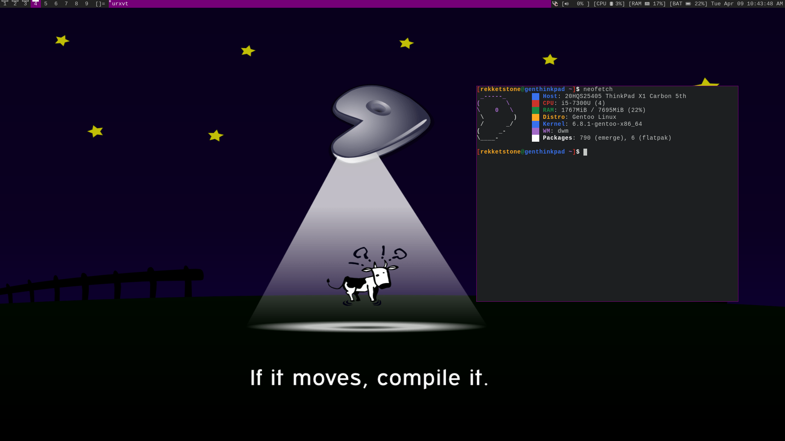

# What to know about this setup:
This should include everything in my setup, all configurations of dwm and stuff are in the .config

If you want to use my custom kernel and make.confs, you might want to poke around in there, I didn't really customize too much so it might be a bit "bloated" for some people.

Also the patches to my dwm that you might like are: systray, fancy active bar, fullscreen, and that'sabout all I remember lmao

Here is a screenshot of my setup:

Have fun ig.

Some packages that I personally use:
urxvt, iwd, doas, perl, vim, pipewire, alsa, clipnotify, brightnessctl, xorg (obviously), and uhh yeah that's all I think that might be "needed" for this setup atleast
